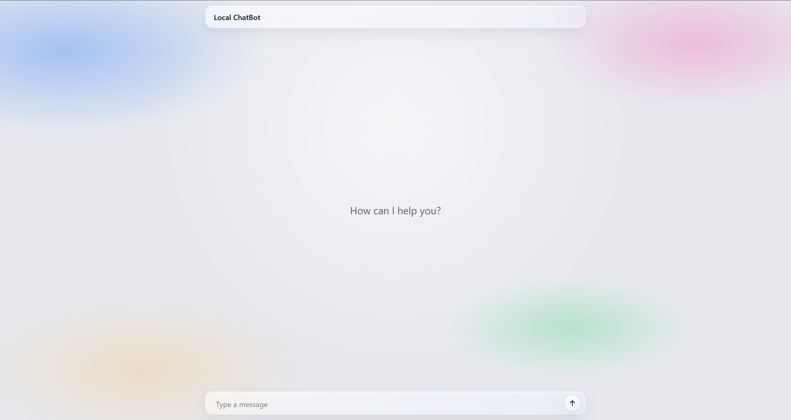
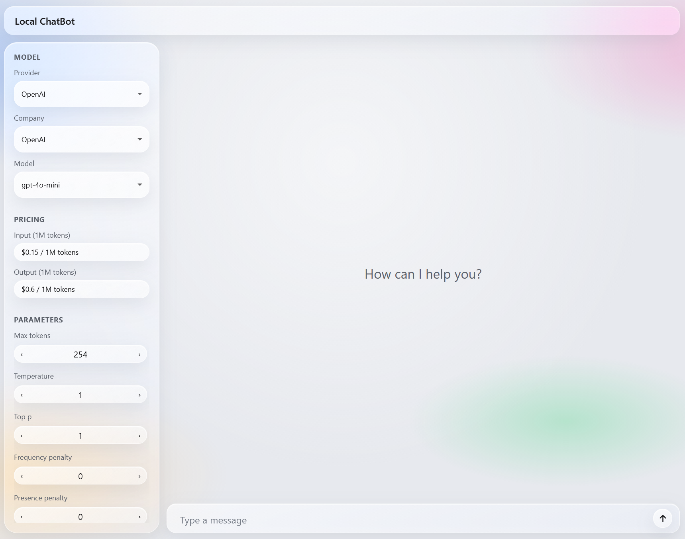
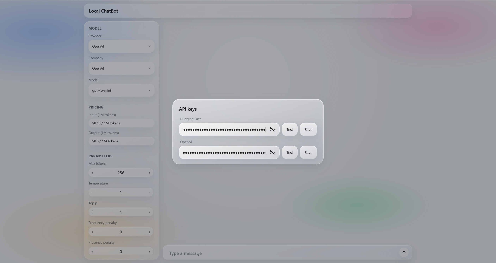
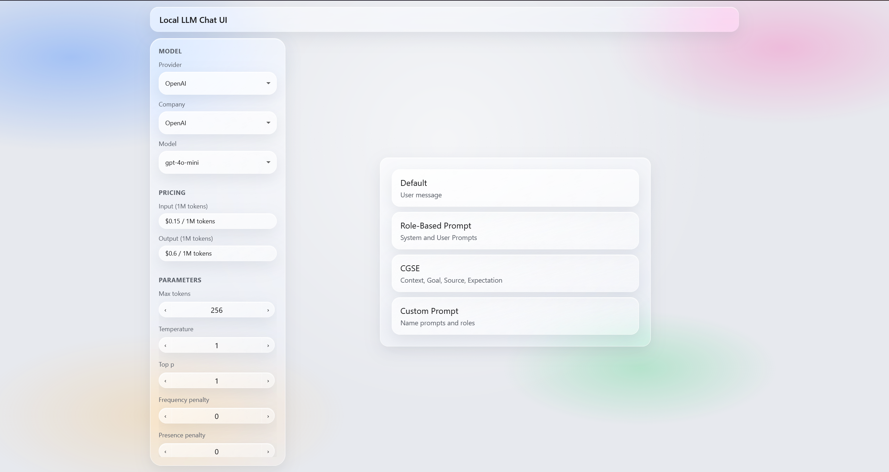
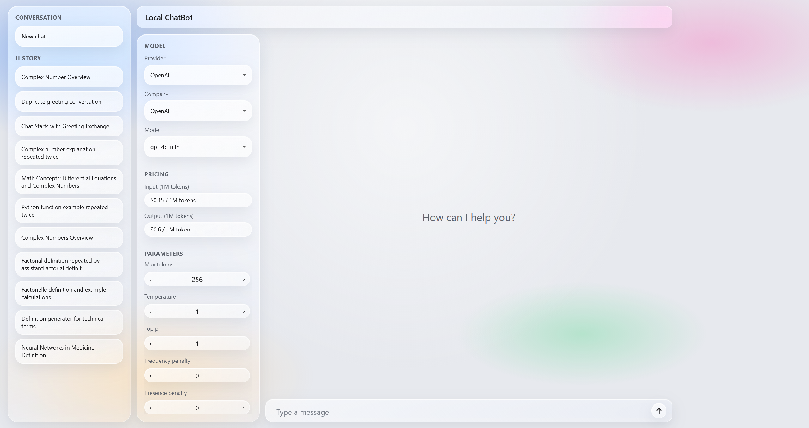
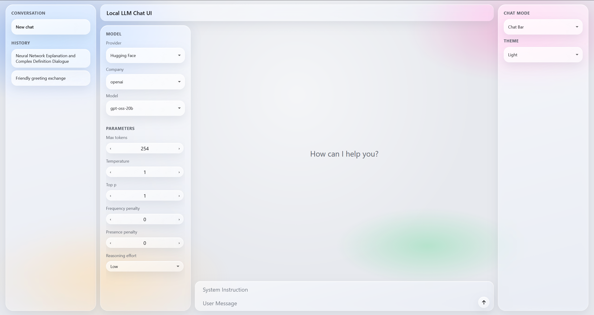

# Local-LLM-Chat-User-Interface

## Definition

This project is a minimalist chat interface you run on your own machine to talk to language models.



## Project

The workspace is meant to stay fully transparent and readable.  

Models can be loaded locally or reached through a provider. Each one exposes its parameters, so the run can be tuned instead of relying on hidden defaults.  

What's visible:
- the model, its company, and its provider
- the parameters that will be used with the user request
- the prompts, which are assembled from the prompt configuration layout, with nothing added behind the scenes
  
Common features from a chat product are also developed:
- sending a request and receiving a streamed assistant reply
- keeping conversation threads, with new chats and generated titles
- controlling how the reply is generated, and stopping a run in progress
- editing, deleting, or copying messages in the current conversation 

## Features

The interface looks minimalist on purpose. The sections below cover how the project works.

### Providers

Providers list models from each company and, when available, expose their parameters, pricing, and so on.

Here are the providers developed so far for this project:

- `Hugging Face`: hub models. A token is required when the catalog or inference needs it.
- `OpenAI`: paid OpenAI chat models, with pricing, token counts, and cost.
- `Local`: a model folder on disk, loaded with Transformers.
- `Test`: a fixed markdown reply, used to exercise the UI without a remote model.

Click on the **Local LLM Chat User Interface** header to expand the workspace and open the Model panel:


To use providers that require an API key, right-click the **Local LLM Chat User Interface** header and select the API Key option:


On the API Key overlay, keys can be tested and saved to the `infra/env` file.

### Prompt layouts

Public chat UIs often hide how a prompt is built. Here, one of the most interesting features is that every field that goes to the model is visible, with a clear role, and nothing extra is added behind the scenes.

Pick a layout so each field is explicit:

- `Default`: a single user message.
- `Role-Based Prompt`: the usual chat-completion split: a system instruction and a user message.
- `CGSE`: inspired by Microsoft's prompting practice. A clear answer needs a clear question, so the user turn is split into four main concepts: Context, Goal, Source, and Expectation.
- `Custom Prompt`: the number of prompt fields, and whether each one is a system or user role, can be defined.

To switch layout, click the area between the thread and the prompt bar (Chat Bar mode) and select a layout:


### Conversation History

Like other chat UIs, a new chat can be started and past threads are kept. Conversations are stored locally as JSON under `data/history/`.

Here is a list of features found on a common chat interface:

- `New chat`: start an empty conversation.
- `History`: list saved threads. A conversation is written after the first completed exchange.
- `Title generation`: a first title from the first user question and assistant reply, then a final title after the second exchange (using the first turn as well). Titles are generated with `openai/gpt-oss-20b` by default (can be changed only in the code).
- `History actions` (right-click a saved chat):
  1. Rename the conversation title.
  2. Delete the conversation.

Click the left rail to open the conversation sidebar:


### Project Settings

Chat Mode allows the layout to be selected in two ways:
- `Chat Bar`: the prompt layout is picked from the conversation column.
- `Default`: keep the selected prompt layout on the left sidebar.

In Default mode, right-click a prompt layout to edit or delete it.

Theme setting personalizes the project's appearance with different color schemes:
- `Light`: bright and clean interface with a white background and standard accent colors.
- `Dark`: deep black background for a sleek, low-light experience.
- `Custom`: fully customizable palette—colors can be chosen for the background and all liquid glass UI elements (conversation bar, buttons, sidebar, etc.).

Click the right rail to open the configuration sidebar:


### Conversation

Here is the list of actions available in the current conversation:

On the conversation bar:
- `Send (arrow icon)`: submit the current user query and wait for a reply.
- `Stop (square icon)`: halt generation or the typewriter from the send control.

By right-clicking a user question:
- `Edit`: change a user or system bubble and resend (layout configuration works while editing).
- `Delete`: remove a user turn and the paired system/assistant messages.

By right-clicking a system response:
- `Information`: show the model snapshot for an assistant reply (model and parameter data, and tokens with prices when available).

By right-clicking a user question or a system response:
- `Copy`: copy the content of the bubble.

## Stack

- Python 3.11
- Conda (environment named after the project folder)
- FastAPI + Uvicorn
- WebSockets (stop an in-flight run)
- OpenAI Python SDK
- Hugging Face Hub + Transformers + PyTorch
- Vanilla JS modules and CSS (liquid glass UI)
- KaTeX (assistant math)
- `debugpy` (Cursor / VS Code, `Python Communication Server`)

## Project Structure

```text
Local-ChatBot/
├── data/
│   ├── configuration/
│   │   └── layouts.json
│   ├── documentation/
│   └── history/
├── infra/
│   ├── env
│   └── requirements.txt
├── script/
│   ├── install_requirements/
│   │   └── installation_requirements_conda.sh
│   ├── launch_program/
│   │   └── launch_project_conda.sh
│   ├── remove_env/
│   │   └── remove_conda.sh
│   └── utils/
│       └── conda_loader.sh
├── src/
│   ├── backend/
│   │   ├── api_key/
│   │   ├── history/
│   │   ├── layout/
│   │   └── model/
│   ├── communication/
│   │   ├── main.py
│   │   ├── api/
│   │   ├── utils/
│   │   │   └── dataclass/
│   │   └── ws_management/
│   └── frontend/
│       ├── index.html
│       ├── script/
│       │   ├── main.js
│       │   ├── api/
│       │   ├── conversation/
│       │   │   └── chat/
│       │   │       └── chat-mode/
│       │   │           └── layouts/
│       │   │               └── action/
│       │   └── workspace-sidebar/
│       └── style/
│           ├── main.css
│           ├── theme/
│           ├── conversation/
│           │   └── chat/
│           │       └── chat-mode/
│           └── workspace-sidebar/
└── .vscode/
    └── launch.json
```

## Installation

Install [Conda](https://www.anaconda.com/download), then from the project root (Git Bash on Windows):

```bash
./script/install_requirements/installation_requirements_conda.sh
```

The script creates a Conda environment with Python 3.11 and installs `infra/requirements.txt`.

Optional GPU PyTorch (see the comment in `infra/requirements.txt`):

```bash
pip install torch==2.14.0 --index-url https://download.pytorch.org/whl/cu130
```

## Quick Start

### Conda launch

From the project root:

```bash
./script/launch_program/launch_project_conda.sh
```

The communication server listens on `http://127.0.0.1:8080` by default (`COMMUNICATION_HOST`, `COMMUNICATION_PORT`). Open that URL in the browser.

Hugging Face and OpenAI keys are set from the header (`API key`), not from the shell.

### Conda cleanup

Remove the project environment:

```bash
./script/remove_env/remove_conda.sh
```

Deactivate the environment first if it is the one currently active in the terminal.

## VS Code / Cursor Debug

The `.vscode/launch.json` file includes:

- `Python Communication Server`

It starts `src/communication/main.py` with `infra/env` and port `8080`. Adjust the Conda `python` path if the environment is not under `anaconda3/envs/Local-ChatBot`.

## Contact Information

For inquiries or feedback, please contact me at [alexisegea@outlook.com](mailto:alexisegea@outlook.com).

## Copyright

© 2026 Alexis EGEA. All Rights Reserved.